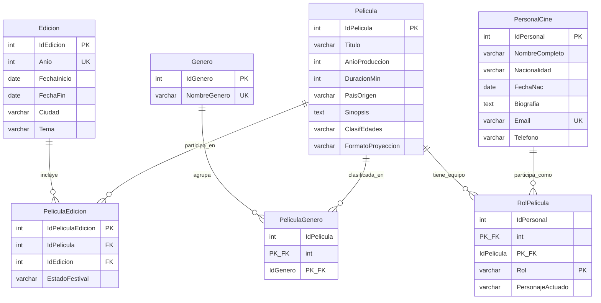
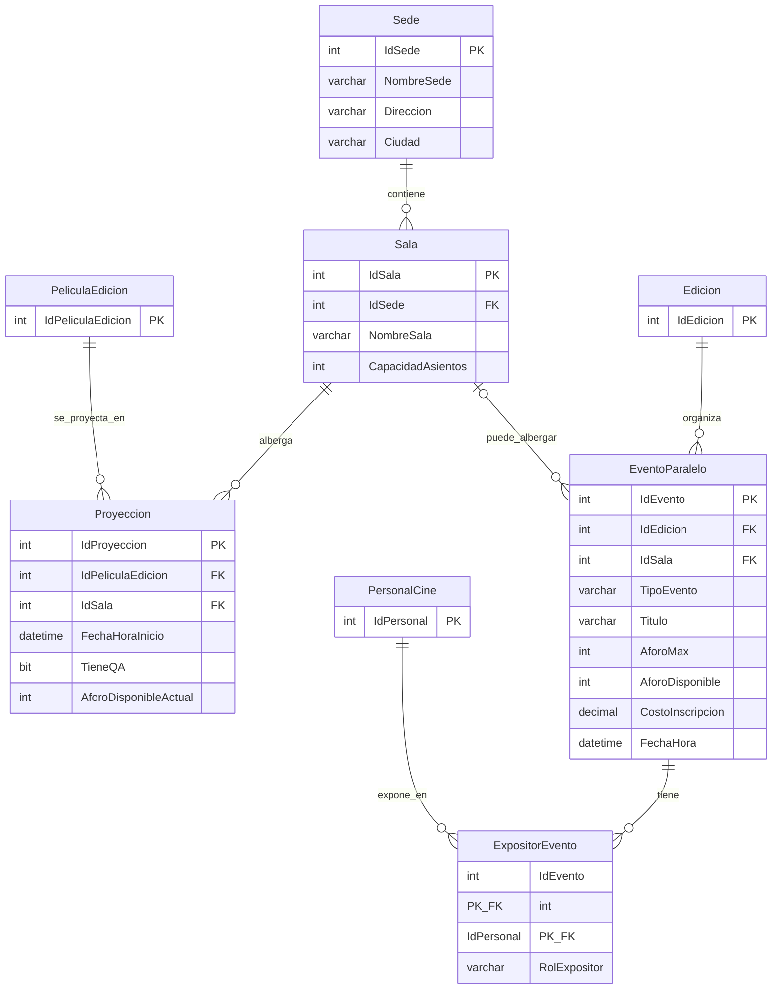
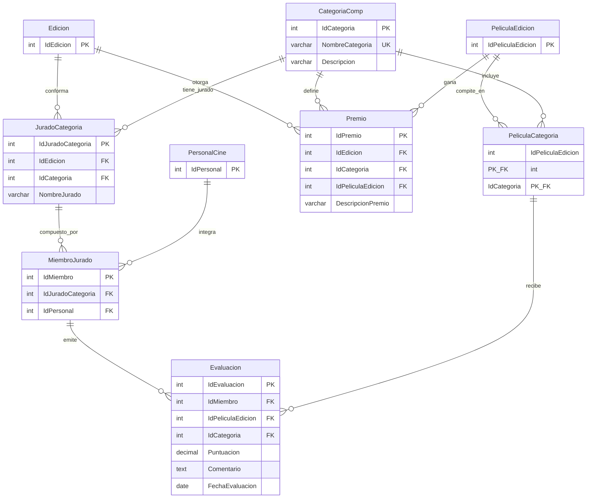
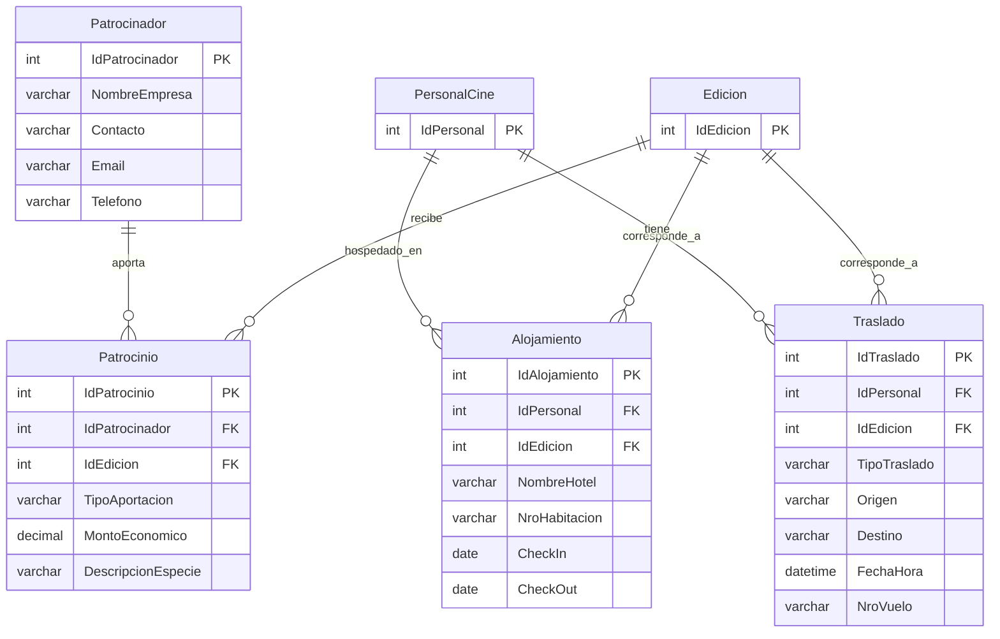

# Diagrama Entidad-Relación (DER) - FestCine

Este documento contiene el DER del sistema FestCine, expresado en notación Mermaid
(`erDiagram`). Se incluye primero un **diagrama general** con las 33 tablas y sus
relaciones, y luego **5 diagramas por módulo** (con atributos) para facilitar la
lectura, agrupados según las áreas funcionales descritas en el enunciado:

- **A. Catálogo Cinematográfico y Personal**
- **B. Agenda, Sedes y Eventos Paralelos**
- **C. Competición, Jurados y Premios**
- **D. Clientes, Acreditaciones y Ventas**
- **E. Logística y Patrocinios**

> Para visualizar los diagramas, pegar el bloque ```mermaid``` en
> https://mermaid.live o usar la extensión "Markdown Preview Mermaid Support" en VS Code.

---

## 1. Diagrama General (33 entidades)

```mermaid
erDiagram
    %% ===== MÓDULO A: Catálogo Cinematográfico y Personal =====
    Edicion ||--o{ PeliculaEdicion : incluye
    Pelicula ||--o{ PeliculaEdicion : participa_en
    Pelicula ||--o{ PeliculaGenero : clasificada_en
    Genero ||--o{ PeliculaGenero : agrupa
    PersonalCine ||--o{ RolPelicula : participa_como
    Pelicula ||--o{ RolPelicula : tiene_equipo

    %% ===== MÓDULO B: Agenda, Sedes y Eventos Paralelos =====
    Sede ||--o{ Sala : contiene
    Sala ||--o{ Proyeccion : alberga
    PeliculaEdicion ||--o{ Proyeccion : se_proyecta_en
    Edicion ||--o{ EventoParalelo : organiza
    Sala |o--o{ EventoParalelo : puede_albergar
    EventoParalelo ||--o{ ExpositorEvento : tiene
    PersonalCine ||--o{ ExpositorEvento : expone_en

    %% ===== MÓDULO C: Competición, Jurados y Premios =====
    Edicion ||--o{ JuradoCategoria : conforma
    CategoriaComp ||--o{ JuradoCategoria : tiene_jurado
    JuradoCategoria ||--o{ MiembroJurado : compuesto_por
    PersonalCine ||--o{ MiembroJurado : integra
    PeliculaEdicion ||--o{ PeliculaCategoria : compite_en
    CategoriaComp ||--o{ PeliculaCategoria : incluye
    MiembroJurado ||--o{ Evaluacion : emite
    PeliculaCategoria ||--o{ Evaluacion : recibe
    Edicion ||--o{ Premio : otorga
    CategoriaComp ||--o{ Premio : define
    PeliculaEdicion ||--o{ Premio : gana

    %% ===== MÓDULO D: Clientes, Acreditaciones y Ventas =====
    Asistente ||--o{ Acreditacion : posee
    Edicion ||--o{ Acreditacion : valida
    Asistente ||--o{ Venta : realiza
    Venta ||--|| Pago : genera
    Venta ||--|| Factura : emite
    Venta ||--o{ Entrada : incluye
    Proyeccion ||--o{ Entrada : vendida_para
    Tarifa ||--o{ Entrada : aplica
    Venta ||--o{ EntradaEvento : incluye
    EventoParalelo ||--o{ EntradaEvento : vendida_para
    Tarifa ||--o{ EntradaEvento : aplica
    Venta ||--|| Abono : genera
    Tarifa ||--o{ Abono : aplica
    TipoAbono ||--o{ Abono : define
    Abono ||--o{ AbonoProyeccion : habilita
    Proyeccion ||--o{ AbonoProyeccion : incluida_en

    %% ===== MÓDULO E: Logística y Patrocinios =====
    PersonalCine ||--o{ Alojamiento : hospedado_en
    Edicion ||--o{ Alojamiento : corresponde_a
    PersonalCine ||--o{ Traslado : tiene
    Edicion ||--o{ Traslado : corresponde_a
    Patrocinador ||--o{ Patrocinio : aporta
    Edicion ||--o{ Patrocinio : recibe
```



---

## 2. Módulo A — Catálogo Cinematográfico y Personal



**Notas:**
- `PeliculaGenero` resuelve la relación M:N "una película puede tener varios géneros".
- `PeliculaEdicion` resuelve el hecho de que una misma película (catálogo histórico)
  puede postularse en **distintas ediciones** del festival, cada una con su propio
  `EstadoFestival` (Postulada, Seleccionada, Rechazada, Premiada).
- `RolPelicula` resuelve la relación M:N "una persona puede tener varios roles en
  varias películas" (ej. director y actor en la misma obra), incluyendo el atributo
  `PersonajeActuado` cuando el rol es de actuación.

---

## 3. Módulo B — Agenda, Sedes y Eventos Paralelos



**Notas:**
- `Proyeccion.AforoDisponibleActual` se inicializa con `Sala.CapacidadAsientos`
  (lo hace el trigger `TR1_ControlAgenda`) y se decrementa con cada venta
  (ver [03_Asunciones.md](03_Asunciones.md)).
- `EventoParalelo.IdSala` es **opcional** (NULL permitido): algunos eventos
  (ej. cócteles) pueden realizarse fuera de las salas de proyección.
- `ExpositorEvento` resuelve la relación M:N "un evento puede tener varios
  expositores, y una persona puede exponer en varios eventos".

---

## 4. Módulo C — Competición, Jurados y Premios



**Notas:**
- `JuradoCategoria` representa "el jurado de la categoría X en la edición Y"
  (UNIQUE por Edicion+Categoria). `MiembroJurado` son las personas que integran
  ese jurado — así un mismo `PersonalCine` puede integrar jurados de **distintas**
  categorías (vía distintos `IdJuradoCategoria`).
- `PeliculaCategoria` indica en qué categorías compite cada película de una
  edición; `Evaluacion` tiene FK compuesta hacia `PeliculaCategoria`
  (`IdPeliculaEdicion`, `IdCategoria`) para garantizar que solo se evalúe una
  película en una categoría en la que efectivamente compite.
- `Premio` tiene `UNIQUE (IdEdicion, IdCategoria)`: un solo ganador por
  categoría y edición.

---

## 5. Módulo D — Clientes, Acreditaciones y Ventas

```mermaid
erDiagram
    Asistente {
        int IdAsistente PK
        varchar NombreCompleto
        varchar Email UK
        varchar Telefono
        varchar TipoAsistente
    }

    Acreditacion {
        int IdAcreditacion PK
        int IdAsistente FK
        int IdEdicion FK
        varchar TipoAcred
        date FechaVencimiento
    }

    Tarifa {
        int IdTarifa PK
        varchar TipoTarifa UK
        decimal Monto
    }

    TipoAbono {
        int IdTipoAbono PK
        varchar NombreTipoAbono UK
        varchar Descripcion
        int CantidadMaxProyecciones
        decimal PrecioBase
    }

    Venta {
        int IdVenta PK
        int IdAsistente FK
        datetime FechaVenta
        varchar TipoVenta
        decimal Total
        varchar EstadoVenta
    }

    Pago {
        int IdPago PK
        int IdVenta FK_UK
        varchar MetodoPago
        decimal MontoPagado
        varchar EstadoPago
        datetime FechaPago
    }

    Factura {
        int IdFactura PK
        int IdVenta FK_UK
        varchar NroFactura UK
        datetime FechaEmision
        decimal MontoTotal
    }

    Entrada {
        int IdEntrada PK
        int IdVenta FK
        int IdProyeccion FK
        int IdTarifa FK
        datetime FechaCompra
        varchar CodigoAcceso UK
        bit Asistio
    }

    EntradaEvento {
        int IdEntradaEvento PK
        int IdVenta FK
        int IdEvento FK
        int IdTarifa FK
        datetime FechaCompra
        varchar CodigoAcceso UK
        bit Asistio
    }

    Abono {
        int IdAbono PK
        int IdVenta FK_UK
        int IdTarifa FK
        int IdTipoAbono FK
        datetime FechaCompra
        decimal MontoTotal
    }

    AbonoProyeccion {
        int IdAbono PK_FK
        int IdProyeccion PK_FK
        varchar CodigoAcceso UK
        bit Asistio
        datetime FechaUso
    }

    Proyeccion {
        int IdProyeccion PK
    }

    EventoParalelo {
        int IdEvento PK
    }

    Edicion {
        int IdEdicion PK
    }

    Asistente ||--o{ Acreditacion : posee
    Edicion ||--o{ Acreditacion : valida
    Asistente ||--o{ Venta : realiza
    Venta ||--|| Pago : genera
    Venta ||--|| Factura : emite
    Venta ||--o{ Entrada : incluye
    Proyeccion ||--o{ Entrada : vendida_para
    Tarifa ||--o{ Entrada : aplica
    Venta ||--o{ EntradaEvento : incluye
    EventoParalelo ||--o{ EntradaEvento : vendida_para
    Tarifa ||--o{ EntradaEvento : aplica
    Venta ||--|| Abono : genera
    Tarifa ||--o{ Abono : aplica
    TipoAbono ||--o{ Abono : define
    Abono ||--o{ AbonoProyeccion : habilita
    Proyeccion ||--o{ AbonoProyeccion : incluida_en
```

**Notas:**
- `Venta` es la entidad central de todo acceso pagado (entrada individual,
  entrada a evento o abono), identificada por `TipoVenta`. `Pago` y `Factura`
  tienen `IdVenta` con `UNIQUE`, por lo que la relación es **1:1**.
- `Entrada` (proyección), `EntradaEvento` (evento paralelo) y `Abono`
  (acceso múltiple) son **especializaciones** de `Venta` según `TipoVenta`.
- `AbonoProyeccion` resuelve la relación M:N "un abono da acceso a varias
  proyecciones, y una proyección puede estar incluida en varios abonos",
  generando un `CodigoAcceso` único por proyección dentro del abono.

---

## 6. Módulo E — Logística y Patrocinios



**Notas:**
- `Alojamiento` y `Traslado` están ligados a `PersonalCine` (invitados:
  directores, jurados, expositores, etc.) y a la `Edicion` correspondiente,
  permitiendo que la misma persona tenga logística distinta en cada edición.
- `Patrocinio` registra el aporte de un `Patrocinador` a una `Edicion`
  específica, con `TipoAportacion` ('Economica' usa `MontoEconomico`,
  'Especie' usa `DescripcionEspecie`).
